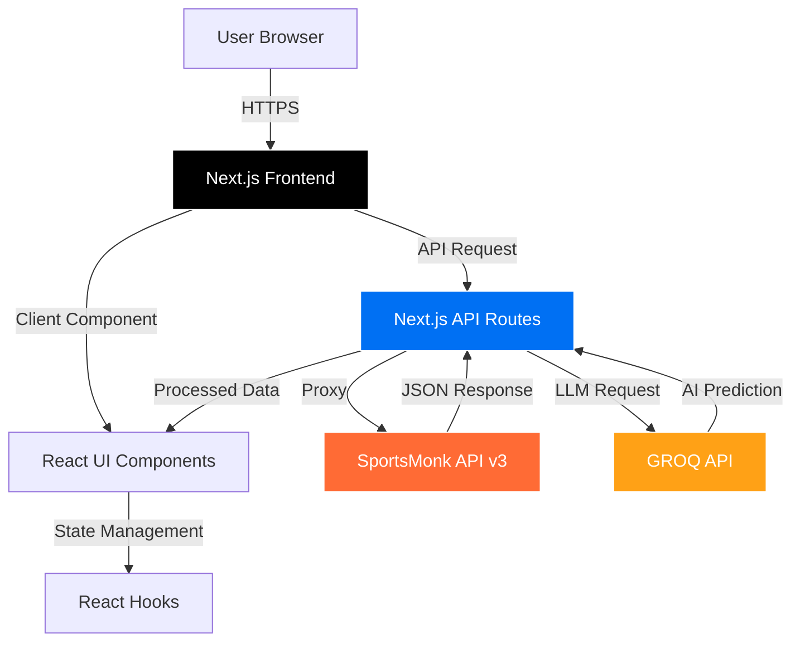
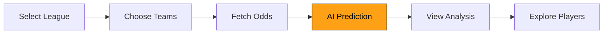

<div align="center">

# ⚽ Copascore AI

### AI-Powered Football Analytics & Prediction Platform

[](https://nextjs.org/)
[](https://www.typescriptlang.org/)
[](https://reactjs.org/)
[](https://tailwindcss.com/)
[](LICENSE)

[🚀 Features](#-features) • [📦 Quick Start](#-quick-start) • [🛠️ Tech Stack](#️-tech-stack) • [📖 Documentation](#-documentation) • [🤝 Contributing](#-contributing)

<!-- 

Add your banner image here
-->

</div>

---

## 🎯 Overview

**Copascore** is a cutting-edge football analytics platform that combines real-time sports data with advanced AI to deliver intelligent match predictions, comprehensive player statistics, and league simulations. Leveraging the **SportsMonk API** and **GROQ's Llama LLM**, Copascore provides data-driven insights that help users understand match outcomes, analyze player performance, and simulate entire league seasons.

### Why This Platform?

| Feature | Description |
|---------|-------------|
| 🤖 **AI-Powered Predictions** | Utilizes GROQ's Llama 3 70B model for intelligent match outcome analysis with confidence scoring and detailed reasoning |
| 📊 **Real-Time Data** | Integrates with SportsMonk API v3 for live fixtures, odds, standings, and comprehensive player statistics |
| ⚡ **Lightning Fast** | Built on Next.js 16 with App Router for optimal performance and server-side rendering |
| 🎨 **Premium UX** | Modern, responsive interface with interactive data visualizations and seamless user experience |
| 🔒 **Secure Architecture** | API keys protected server-side, with Next.js API routes acting as secure proxy layer |
| 🎯 **League Simulations** | Full-season simulations with AI-generated league tables and realistic performance metrics |

---

## 📦 Quick Start

```bash
# Clone the repository
git clone https://github.com/yourusername/Copascore.git && cd Copascore

# Install dependencies
cd frontend && npm install

# Configure environment variables
echo "NEXT_PUBLIC_SPORTSMONK_API_KEY=your_key_here" > .env.local
echo "NEXT_PUBLIC_GROQ_API_KEY=your_key_here" >> .env.local

# Start development server
npm run dev
```

Open [http://localhost:3000](http://localhost:3000) to see the application 🎉

📚 Need detailed setup? See [Installation Guide](#-installation) | [Deployment Guides](#-deployment)

---

## 🎬 Demo

<!-- 
**🌐 Live Demo**: [copascore.vercel.app](https://copascore.vercel.app)
Add your live demo link here
-->

<details>
<summary>📸 Screenshots (Click to expand)</summary>

```
Add screenshots here:
- Match Prediction Interface
- League Simulation Dashboard
- Player Statistics View
- AI Analyst Chat Interface
```

</details>

---

## 📑 Table of Contents

- [Features](#-features)
- [Tech Stack](#️-tech-stack)
- [Architecture](#-architecture)
- [Installation](#-installation)
- [Usage](#-usage)
- [Project Structure](#-project-structure)
- [API Documentation](#-api-documentation)
- [Deployment](#-deployment)
- [Testing](#-testing)
- [Documentation](#-documentation)
- [Roadmap](#-roadmap)
- [Contributing](#-contributing)
- [Support](#-support)

---

## ✨ Features

<table>
<tr>
<td width="50%">

### 🎯 Match Prediction Engine

- ⚡ Real-time odds fetching from multiple bookmakers
- 🤖 AI-powered outcome predictions (Win/Draw/Loss)
- 📈 Confidence scoring with probability distribution
- 📝 Detailed reasoning and match analysis
- 👥 Squad-level player statistics integration
- 📊 Interactive visualization of predictions

</td>
<td width="50%">

### 🏆 League Simulation

- 🎲 Full-season AI-powered simulations
- 📋 Dynamic league table generation
- 📊 Performance metrics (W/D/L, Goals, Points)
- 🔄 Multi-league support (Denmark, Scotland)
- ⚡ Instant results with realistic standings
- 📈 Goal difference calculations

</td>
</tr>
<tr>
<td width="50%">

### 👥 Player Analytics

- 🔍 Comprehensive player database
- 📊 Detailed statistics (Position, Nationality, Age)
- 🏃 Performance metrics visualization
- 🔢 Squad-based filtering by team
- 📸 Player photos and team logos
- 🎯 Radar charts for skill analysis

</td>
<td width="50%">

### 💬 AI Analyst Chat

- 🤖 Interactive football analyst powered by GROQ
- 💡 Real-time insights and predictions
- 📝 Context-aware responses
- 🏟️ Match, team, and player analysis
- ⚡ Fast response times with streaming
- 🎯 Mixtral-8x7b language model

</td>
</tr>
<tr>
<td width="50%">

### 📊 Data Visualization

- 📈 Interactive charts (Recharts & Chart.js)
- 🎨 Responsive design with Tailwind CSS
- 🌓 Smooth animations and transitions
- 📱 Mobile-optimized views
- 🎯 Real-time data updates
- 🖼️ Team logos and player images

</td>
<td width="50%">

### 🔧 Developer Features

- 🎯 Type-safe development with TypeScript
- 🔒 Secure API key management
- ⚡ Server-side rendering (SSR)
- 🚀 Optimized API route proxying
- 🛡️ Error handling & fallbacks
- 📝 Comprehensive documentation

</td>
</tr>
</table>

---

## 🛠️ Tech Stack

### Core Technologies


### APIs & Services


### Libraries & Tools


<details>
<summary><b>📋 Complete Technology Breakdown</b></summary>

### Frontend Stack

| Technology | Version | Purpose |
|------------|---------|---------|
| **Next.js** | 16.0.3 | React framework with App Router, SSR, and API routes |
| **React** | 19.2.0 | UI library with React Compiler optimization |
| **TypeScript** | 5.0+ | Type-safe development |
| **Tailwind CSS** | 4.0 | Utility-first styling with PostCSS |
| **Recharts** | 3.5.0 | Composable charting library |
| **Chart.js** | 4.5.1 | Canvas-based charts |
| **React Chart.js 2** | 5.3.1 | React wrapper for Chart.js |
| **Lucide React** | 0.554.0 | Beautiful icon set |
| **Axios** | 1.13.2 | HTTP client for API requests |
| **clsx** | 2.1.1 | Conditional className utility |
| **tailwind-merge** | 3.4.0 | Merge Tailwind classes intelligently |

### Backend Services

| Service | Purpose |
|---------|---------|
| **Next.js API Routes** | Server-side proxy layer for external APIs |
| **SportsMonk API v3** | Football data (fixtures, odds, players, standings) |
| **GROQ API** | LLM inference (Llama 3 70B & Mixtral-8x7b) |

### DevOps & Tooling

| Tool | Purpose |
|------|---------|
| **ESLint** | Code linting with Next.js config |
| **Babel React Compiler** | Automatic React optimization |
| **PostCSS** | CSS processing for Tailwind |
| **Vercel** | Deployment platform (recommended) |
| **Git** | Version control |

</details>

---

## 🏗️ Architecture

### System Flow



### Design Patterns

| Pattern | Implementation | Benefit |
|---------|----------------|---------|
| **API Proxy Pattern** | Next.js API routes act as secure intermediary | Protects API keys, enables CORS handling |
| **Service Layer** | Centralized `api.ts` service | Single source of truth for API calls |
| **Type Safety** | TypeScript interfaces in `types/index.ts` | Compile-time error detection |
| **Component Composition** | Reusable React components | Maintainability and consistency |
| **Error Boundaries** | Try-catch with fallbacks | Graceful degradation |
| **SSR + CSR Hybrid** | Next.js App Router | Optimal performance and SEO |

---

## 💻 Installation

### Prerequisites

- 📦 **Node.js** 18.0 or higher
- 🔑 **SportsMonk API Key** ([Get it here](https://www.sportmonks.com/))
- 🤖 **GROQ API Key** ([Get it here](https://console.groq.com/))
- 💻 **npm** or **yarn** package manager

### 1️⃣ Clone the Repository

```bash
git clone https://github.com/yourusername/Copascore.git
cd Copascore
```

### 2️⃣ Install Dependencies

```bash
cd frontend
npm install
```

### 3️⃣ Configure Environment Variables

Create a `.env.local` file in the `frontend` directory:

```bash
NEXT_PUBLIC_SPORTSMONK_API_KEY=your_sportsmonk_api_key_here
NEXT_PUBLIC_GROQ_API_KEY=your_groq_api_key_here
```

> ⚠️ **Security Note**: Never commit `.env.local` to version control. These keys are used server-side only.

<details>
<summary><b>🔧 Detailed Setup Instructions</b></summary>

### Getting Your API Keys

**SportsMonk API Key:**
1. Visit [sportmonks.com](https://www.sportmonks.com/)
2. Sign up for a free account
3. Navigate to Dashboard → API Keys
4. Copy your API key
5. Free plan includes: Denmark Superliga, Scotland Premiership

**GROQ API Key:**
1. Visit [console.groq.com](https://console.groq.com/)
2. Sign up with Google/GitHub
3. Go to API Keys section
4. Create new API key
5. Copy and save securely

### Alternative: Using .env.example

```bash
cp .env.example .env.local
# Edit .env.local with your favorite editor
nano .env.local
```

</details>

<details>
<summary><b>🐳 Docker Setup (Optional)</b></summary>

```dockerfile
# Create Dockerfile in frontend directory
FROM node:18-alpine

WORKDIR /app

COPY package*.json ./
RUN npm install

COPY . .

RUN npm run build

EXPOSE 3000

CMD ["npm", "start"]
```

Build and run:

```bash
docker build -t copascore .
docker run -p 3000:3000 --env-file .env.local copascore
```

</details>

<details>
<summary><b>⚠️ Common Installation Issues</b></summary>

| Issue | Solution |
|-------|----------|
| `EACCES: permission denied` | Run `sudo chown -R $(whoami) ~/.npm` |
| `Module not found` errors | Delete `node_modules` and `package-lock.json`, run `npm install` |
| Port 3000 already in use | Use `PORT=3001 npm run dev` or kill process on port 3000 |
| API key not working | Ensure no quotes around keys in `.env.local` |
| TypeScript errors | Run `npm run build` to check for type errors |

For more help, see [Troubleshooting Guide](SETUP.md#troubleshooting)

</details>

### 4️⃣ Run Development Server

```bash
npm run dev
```

Open [http://localhost:3000](http://localhost:3000) in your browser 🚀

---

## 🎮 Usage

### Workflow Overview



### Step-by-Step Guide

#### 1️⃣ Making Match Predictions

1. Navigate to **Predict** page from the navbar
2. Select a league (Denmark Superliga or Scotland Premiership)
3. Choose **Home Team** and **Away Team** from dropdowns
4. Click **Get Prediction** button
5. View AI analysis with:
   - Predicted outcome (Win/Draw/Loss)
   - Confidence percentage
   - Probability distribution
   - Detailed reasoning
   - Player statistics for both teams

#### 2️⃣ Running League Simulations

1. Go to **Simulate** page
2. Select desired league
3. Click **Simulate Season**
4. View generated league table with:
   - Final standings
   - Points, wins, draws, losses
   - Goal difference
   - Games played

#### 3️⃣ Exploring Player Database

1. Visit **Players** page
2. Browse all players from available teams
3. Filter by team using dropdown
4. View detailed stats including:
   - Position, nationality, age
   - Team information
   - Player photos

#### 4️⃣ Using AI Analyst Chat

1. Access **Chat** feature (AI Analyst component)
2. Ask questions about:
   - Match predictions
   - Team comparisons
   - Player analysis
   - League insights
3. Receive AI-powered responses in real-time

### Configuration Options

<details>
<summary><b>⚙️ Advanced Configuration</b></summary>

| Parameter | Type | Default | Description |
|-----------|------|---------|-------------|
| `NEXT_PUBLIC_SPORTSMONK_API_KEY` | string | - | Your SportsMonk API key |
| `NEXT_PUBLIC_GROQ_API_KEY` | string | - | Your GROQ API key |
| `PORT` | number | 3000 | Development server port |

### Customizing Available Leagues

Edit [`frontend/src/services/api.ts`](frontend/src/services/api.ts#L9-L14):

```typescript
export const AVAILABLE_LEAGUES = [
  { id: 271, name: 'Denmark Superliga', country: 'Denmark' },
  { id: 501, name: 'Scotland Premiership', country: 'Scotland' },
  // Add more leagues (requires SportsMonk plan upgrade)
];
```

</details>

---

## 📁 Project Structure

```
Copascore/
├── frontend/                          # Next.js frontend application
│   ├── src/
│   │   ├── app/                       # Next.js App Router
│   │   │   ├── api/                   # API Routes (Server-side)
│   │   │   │   ├── chat/              # GROQ chat endpoint
│   │   │   │   │   └── route.ts       # AI analyst chat handler
│   │   │   │   ├── fixtures/          # Fixtures data endpoints
│   │   │   │   │   └── [leagueId]/    # League-specific fixtures
│   │   │   │   ├── odds/              # Betting odds endpoint
│   │   │   │   │   └── route.ts       # Odds fetching with fallback logic
│   │   │   │   ├── players/           # Player data endpoints
│   │   │   │   │   └── squad/[teamId] # Team squad retrieval
│   │   │   │   ├── predict/           # Prediction endpoint
│   │   │   │   │   └── route.ts       # AI prediction handler
│   │   │   │   ├── standings/         # League standings endpoints
│   │   │   │   │   └── [leagueId]/    # League-specific standings
│   │   │   │   └── teams/             # Teams data endpoints
│   │   │   │       └── [leagueId]/    # League-specific teams
│   │   │   ├── players/               # Player pages
│   │   │   │   ├── page.tsx           # Player database view
│   │   │   │   └── [name]/page.tsx    # Individual player page
│   │   │   ├── predict/               # Prediction page
│   │   │   │   └── page.tsx           # Match prediction interface
│   │   │   ├── simulate/              # Simulation page
│   │   │   │   └── page.tsx           # League simulation interface
│   │   │   ├── api-data/              # API data explorer
│   │   │   │   └── page.tsx           # Raw API data viewer
│   │   │   ├── layout.tsx             # Root layout with navbar
│   │   │   ├── page.tsx               # Landing page
│   │   │   └── globals.css            # Global styles
│   │   ├── components/                # React components
│   │   │   ├── AIAnalyst.tsx          # AI chat component
│   │   │   ├── Navbar.tsx             # Navigation bar
│   │   │   ├── PlayerCard.tsx         # Player card component
│   │   │   └── SplashAnimation.tsx    # Loading animation
│   │   ├── services/                  # Service layer
│   │   │   └── api.ts                 # Centralized API service
│   │   ├── types/                     # TypeScript definitions
│   │   │   └── index.ts               # Shared type interfaces
│   │   └── utils/                     # Utility functions
│   │       └── formatters.ts          # Data formatting helpers
│   ├── public/                        # Static assets
│   ├── next.config.ts                 # Next.js configuration
│   ├── tsconfig.json                  # TypeScript configuration
│   ├── tailwind.config.js             # Tailwind CSS configuration
│   ├── postcss.config.mjs             # PostCSS configuration
│   ├── eslint.config.mjs              # ESLint configuration
│   └── package.json                   # Frontend dependencies
├── docs/                              # Documentation files
│   ├── API_ANALYSIS.md                # API capabilities analysis
│   ├── DESIGN_DOC.md                  # System design documentation
│   ├── DEPLOYMENT.md                  # Deployment guides
│   ├── DEPLOYMENT_RENDER.md           # Render-specific deployment
│   ├── SETUP.md                       # Detailed setup guide
│   └── RUN_PROJECT.md                 # Running instructions
├── squad_test.json                    # Test data for squad API
├── package.json                       # Root package configuration
└── README.md                          # This file
```

---

## 📚 API Documentation

### Internal API Routes

All API routes are proxied through Next.js for security and CORS handling.

#### Match Prediction

<table>
<tr>
<th>Endpoint</th>
<th>Method</th>
<th>Description</th>
</tr>
<tr>
<td><code>/api/predict</code></td>
<td>POST</td>
<td>Generate AI-powered match prediction</td>
</tr>
</table>

**Request Body:**
```json
{
  "homeTeam": "FC Copenhagen",
  "awayTeam": "Brondby IF",
  "odds": {
    "home": 1.85,
    "draw": 3.50,
    "away": 4.20
  }
}
```

**Response:**
```json
{
  "prediction": "Home Win",
  "confidence": 72,
  "reasoning": "FC Copenhagen has strong home form...",
  "home_win_probability": 54,
  "draw_probability": 26,
  "away_win_probability": 20
}
```

#### Other Endpoints

| Endpoint | Method | Description | Auth Required |
|----------|--------|-------------|---------------|
| `/api/teams/[leagueId]` | GET | Get all teams in a league | ❌ |
| `/api/fixtures/[leagueId]` | GET | Get fixtures for a league | ❌ |
| `/api/odds` | POST | Fetch betting odds for a match | ❌ |
| `/api/players/squad/[teamId]` | GET | Get team squad and player stats | ❌ |
| `/api/standings/[leagueId]` | GET | Get league standings | ❌ |
| `/api/chat` | POST | Chat with AI analyst | ❌ |

### External APIs

**SportsMonk API v3**: See [API_ANALYSIS.md](API_ANALYSIS.md) for detailed endpoint documentation

**GROQ API**: See [GROQ Documentation](https://console.groq.com/docs/quickstart)

---

## 🚀 Deployment

### Quick Deployment Options

- 🌐 **Vercel** (Recommended) - [One-click deploy](#vercel-deployment)
- 🎨 **Netlify** - Supports Next.js
- 🔧 **Render** - Full stack support
- 🐳 **Docker** - Containerized deployment
- ☁️ **AWS / GCP / Azure** - Cloud platforms

### Vercel Deployment

1. Push code to GitHub
2. Visit [vercel.com](https://vercel.com) and sign in
3. Click **Import Project**
4. Select your repository
5. Configure:
   - **Root Directory**: `frontend`
   - **Framework Preset**: Next.js (auto-detected)
6. Add environment variables:
   - `NEXT_PUBLIC_SPORTSMONK_API_KEY`
   - `NEXT_PUBLIC_GROQ_API_KEY`
7. Click **Deploy**

Your app will be live at `https://your-project.vercel.app` 🎉

### Environment Variables for Production

```bash
# Required
NEXT_PUBLIC_SPORTSMONK_API_KEY=your_production_key
NEXT_PUBLIC_GROQ_API_KEY=your_production_key

# Optional
NODE_ENV=production
NEXT_PUBLIC_API_URL=https://your-api-domain.com
```

📖 For detailed deployment guides, see:
- [DEPLOYMENT.md](DEPLOYMENT.md) - General deployment guide
- [DEPLOYMENT_RENDER.md](DEPLOYMENT_RENDER.md) - Render-specific instructions

---

## 🧪 Testing

```bash
# Frontend tests (to be implemented)
cd frontend
npm test

# Type checking
npm run type-check

# Linting
npm run lint

# Build verification
npm run build
```

---

## 📖 Documentation

- 📘 [Setup Guide](SETUP.md) - Detailed setup instructions and troubleshooting
- 🏗️ [Design Documentation](DESIGN_DOC.md) - System architecture and design patterns
- 🔌 [API Analysis](API_ANALYSIS.md) - SportsMonk API capabilities and endpoints
- 🚀 [Deployment Guide](DEPLOYMENT.md) - Production deployment instructions
- 📝 [Running the Project](RUN_PROJECT.md) - Development workflow guide

---

## 🗺️ Roadmap

### ✅ Completed Features

- [x] Match prediction engine with AI reasoning
- [x] Real-time odds fetching with fallback strategies
- [x] League simulation system
- [x] Player database with statistics
- [x] AI analyst chat interface
- [x] Responsive UI with Tailwind CSS
- [x] TypeScript integration
- [x] Next.js App Router architecture

### 🚧 In Progress

- [ ] User authentication and profiles
- [ ] Historical prediction tracking
- [ ] Enhanced data visualizations
- [ ] Mobile app version

### 📅 Planned Features

- [ ] **Database Integration** - PostgreSQL for historical data
- [ ] **Prediction Accuracy Tracking** - Track AI performance over time
- [ ] **Expanded League Coverage** - Add Premier League, La Liga, Serie A
- [ ] **Live Match Updates** - Real-time score polling
- [ ] **Favorites System** - Save favorite teams and get notifications
- [ ] **Advanced Statistics** - xG, possession, heat maps
- [ ] **Social Features** - Share predictions, compete with friends
- [ ] **API Rate Limiting** - Smart caching and request optimization
- [ ] **Multi-language Support** - i18n implementation
- [ ] **Dark Mode** - Theme switching capability

💡 Have a feature request? [Open an issue](https://github.com/yourusername/Copascore/issues/new) with the `enhancement` label!

---

## 🤝 Contributing

<div align="center">


</div>

We welcome contributions! Here's how you can help:

### 1️⃣ Fork the Repository

Click the **Fork** button at the top right of this page.

### 2️⃣ Create a Feature Branch

```bash
git checkout -b feature/amazing-feature
```

### 3️⃣ Make Your Changes

Follow our coding standards and test thoroughly.

### 4️⃣ Commit Your Changes

```bash
git commit -m "feat: add amazing feature"
```

### 5️⃣ Push to Your Fork

```bash
git push origin feature/amazing-feature
```

### 6️⃣ Open a Pull Request

Go to the original repository and click **New Pull Request**.

### Contribution Guidelines

<table>
<tr>
<td width="50%">

**Do's** ✅
- Write clean, documented code
- Follow existing code style
- Add tests for new features
- Update documentation
- Use descriptive commit messages
- Test before submitting PR

</td>
<td width="50%">

**Don'ts** ❌
- Commit API keys or secrets
- Break existing functionality
- Ignore TypeScript errors
- Skip documentation
- Submit untested code
- Include unrelated changes

</td>
</tr>
</table>

### Development Setup

```bash
# Fork and clone
git clone https://github.com/YOUR_USERNAME/Copascore.git
cd Copascore/frontend

# Install dependencies
npm install

# Create feature branch
git checkout -b feature/my-feature

# Start development server
npm run dev

# Run tests
npm test

# Check types
npm run type-check
```

---

## 💬 Support

- 📖 **Documentation**: Check our [docs](#-documentation) for guides and API references
- 🐛 **Bug Reports**: [Open an issue](https://github.com/yourusername/Copascore/issues)
- 💡 **Feature Requests**: [Request a feature](https://github.com/yourusername/Copascore/issues/new)
- 📧 **Contact**: Reach out via GitHub issues for questions

---

<div align="center">

## ⚽ Copascore

Made with ❤️ by the Copascore Team

[MIT License](LICENSE) • [Documentation](DESIGN_DOC.md) • [Contributing](#-contributing)

**Give us a ⭐ if you find this project interesting!**

</div>

